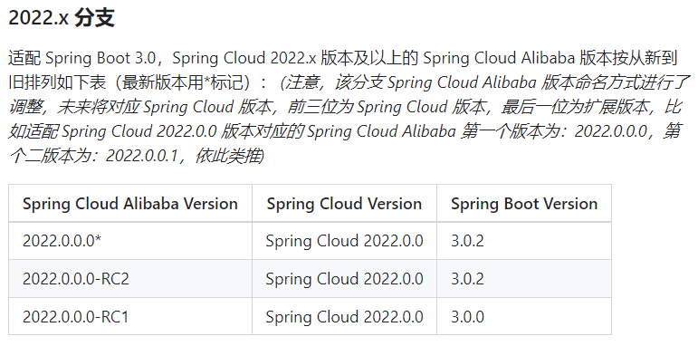
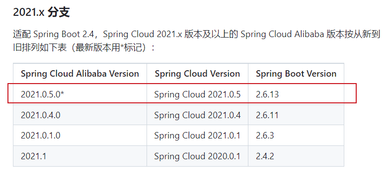
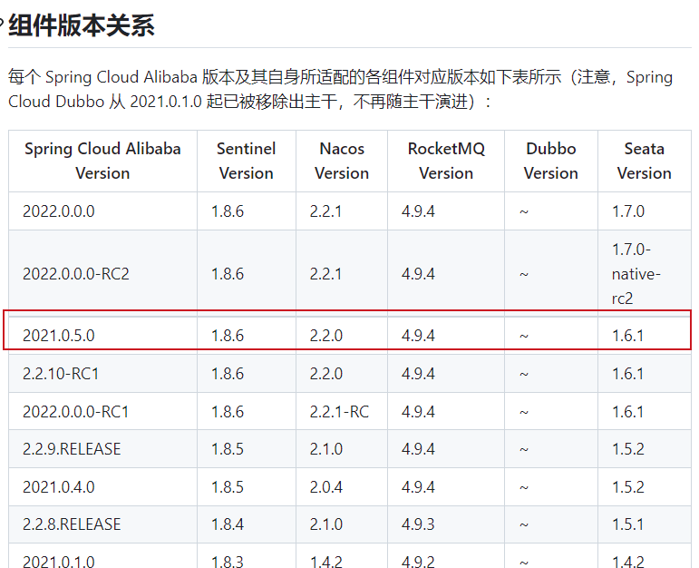
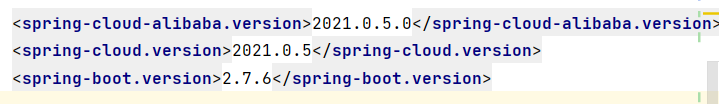

# b2c_mall

#### 介绍
b2c 商城项目,使用当前主流spring cloud alibaba相关技术.

#### 软件架构
软件架构说明

#### 安装教程

1.  xxxx
2.  xxxx
3.  xxxx

#### 使用说明

1.  xxxx
2.  xxxx
3.  xxxx

#### 参与贡献

1.  Fork 本仓库
2.  新建 Feat_xxx 分支
3.  提交代码
4.  新建 Pull Request

#### 版本说明
* 软件版本周期介绍
  软件版本周期:

  * α、β、λ 常用来表示软件测试过程中的三个阶段。

  - α(alpha) 是第一阶段，一般只供内部测试使用；
  - β(Beta) 是第二个阶段，已经消除了软件中大部分的不完善之处，但仍有可能还存在缺陷和漏洞，一般只提供给特定的用户群来测试使用；
  - λ(Release Candidate) 是第三个阶段，此时产品已经相当成熟，只需在个别地方再做进一步的优化处理即可上市发行。

* 官方版本推荐

* 实际使用的版本

#### 特技

1.  使用 Readme\_XXX.md 来支持不同的语言，例如 Readme\_en.md, Readme\_zh.md
2.  Gitee 官方博客 [blog.gitee.com](https://blog.gitee.com)
3.  你可以 [https://gitee.com/explore](https://gitee.com/explore) 这个地址来了解 Gitee 上的优秀开源项目
4.  [GVP](https://gitee.com/gvp) 全称是 Gitee 最有价值开源项目，是综合评定出的优秀开源项目
5.  Gitee 官方提供的使用手册 [https://gitee.com/help](https://gitee.com/help)
6.  Gitee 封面人物是一档用来展示 Gitee 会员风采的栏目 [https://gitee.com/gitee-stars/](https://gitee.com/gitee-stars/)
