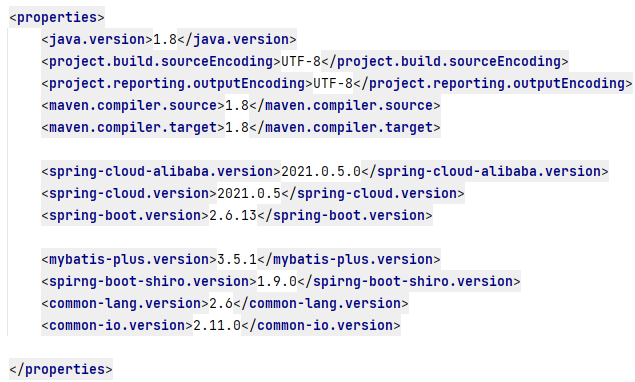
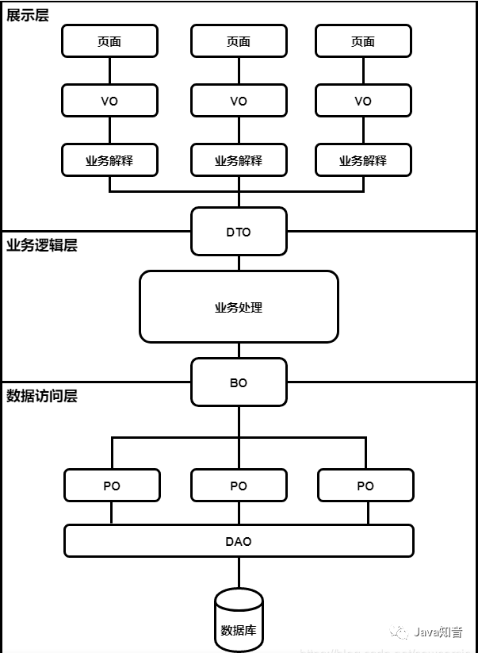
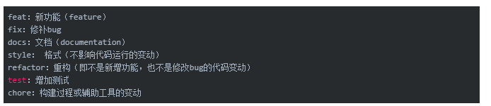

# b2c_mall

#### 介绍
b2c 商城项目,使用当前主流spring cloud alibaba相关技术.

#### 软件架构
软件架构说明

#### 安装教程

1.  xxxx
2.  xxxx
3.  xxxx

#### 使用说明

1.  xxxx
2.  xxxx
3.  xxxx

#### 参与贡献

1.  Fork 本仓库
2.  新建 Feat_xxx 分支
3.  提交代码
4.  新建 Pull Request

#### 版本说明
* 软件版本周期介绍
  软件版本周期:

  * α、β、λ 常用来表示软件测试过程中的三个阶段。

  - α(alpha) 是第一阶段，一般只供内部测试使用；
  - β(Beta) 是第二个阶段，已经消除了软件中大部分的不完善之处，但仍有可能还存在缺陷和漏洞，一般只提供给特定的用户群来测试使用；
  - λ(Release Candidate) 是第三个阶段，此时产品已经相当成熟，只需在个别地方再做进一步的优化处理即可上市发行。
  
* 官方版本推荐
* 
* 
* 

---
* 实际使用的版本
* 
* 其他版本都是有使用的官方管理的版本

#### 启动项目
##### 1.启动minio服务
```shell
 docker run  --name minio01 -d -p 9000:9000 -p 9001:9001 \
 -v /data/minios/minio01/config/:/root/.minio \
 -v /data/minios/minio01/data/:/data \
 -e "MINIO_ROOT_USER=minio" \
 -e "MINIO_ROOT_PASSWORD=password" \
 -e "MINIO_SERVER_URL=http://10.0.0.208:9000" \
-e "MINIO_BROWSER_REDIRECT_URL=http://10.0.0.208:9001" \
 minio/minio server /data --console-address :9001
```


#### 扩展资料(备忘)
##### 1. model

1. POJO（Plain Ordinary Java Object 简单Java对象)
   * 实际就是普通JavaBeans，是为了避免和EJB（Enterprise Java Beans 企业级JavaBeans）混淆所创造的简称，也称为（Plain Old Java Object 又普通又老的对象）。相比于EJB来说，的确是老的对象，因为ORM中间件的日趋流行，POJO又重新焕发了光彩。 
   * POJO的内在含义是指：
   那些没有继承任何类、也没有实现任何接口，更没有被其它框架侵入的java对象。它仅包含自身的属性以及自身属性的getter和setter方法，这意味者POJO可以方便的从一个框架迁移到另一个框架中，或者框架升级也会对代码毫无影响，因此而得到复用。
   * 一般，当需要持久化对象时，人们喜欢将该对象放在名为xxxPOJO的目录中。当然，不建议这样命名。 POJO实际上是包括BO/VO/PO/DO等一系列对象的总称。有的团队规定禁止命名成xxxPOJO。


2. PO(persistence object 持久层对象)
    * PO是在ORM（对象关系映射）中与数据表的一条记录相匹配，自身属性与数据表字段一一对应。可以将数据表中的一条记录作为一个对象处理，并可以转化为其它对象。
      面对不同的数据源时，比如文档型数据库，对象型数据库等时，顾名思义PO是DAO层为进行持久化操作而准备的对象。
    * 包含getter、setter方法。
    * 不包含业务逻辑与数据库的访问方法。因为数据库本身不包含业务逻辑。
    * PO平常不一定需要实现序列化，只是当采用分布式存储或者需要作为前端输出及远程调用使用时，应该实现序列化
    * 在《阿里巴巴开发手册》中，PO也叫DO（Data Object）数据对象，与数据库表结构一一对应，通过DAO层向上传输数据源对象。 
    

3. DAO(data access object 数据访问对象)
    * 包含对数据的访问，负责持久层的操作 。通常需要结合PO来访问数据库，主要用来封装对数据的访问，并不转化成其它对象。
    * 在基于“事务脚本”的业务设计时，它包含业务逻辑。否则，一般只包含持久化的封装。


4. DTO（Data Transfer Object 数据传输对象）
    * 数据传输对象，是在应用网络层需要传输的对象，是一个为了减少方法调用次数而在进程间传输数据的对象。
    * 在《阿里巴巴开发手册中》规定是Service 或 Manager 向外传输的对象。
    * 某些人称这个为“值对象”，当然还是有稍许区别。值对象追求对象不可变，DTO的对象是可修改，可改变的。
    * 1.什么是DTO?
      * 从输入来看，在进行请求时，应用在接口接收传入对象，然后又转换成实体进行持久化。在此过程中，传入的对象就是DTO。
        它的命名方式可能是Param、Query 、Command、等。Param 为查询参数对象，适用于各层，一般用做接受前端参数对象。Param 和 Query 的出现是为了不使用 Map 做为接收参数的对象。
      * 从输出来看，在进行返回响应时，若数据表有100个字段，那么PO中就有100个属性，而界面可能只需要其中10个属性，那么查询数据库后，对象就需要由PO转化成DTO。
        DTO可能还需要组合多个表查询到的对象成为一个大对象，以便减少网络的调用，或者给前端传输一些不在数据库中查到的属性，所以需要添加属性。
    * 2.DTO里面有什么？
      * 一般不建议创建DTO，因为里面就一些属性和getter、setter方法，业务价值小，作用仅仅是在一次调用中传输几部分信息。
        其中，属性必须为原始数据类型，因为DTO需要被序列化以便能在连接中传播。
        它只包含自身数据的存储，而不包含业务逻辑。
        在不同的客户端之间，通常需要DTO组装器完成领域对象和DTO之间的转化。
    * 3.DTO怎么使用？
      * 对于不同的客户端展现，可以选择一次封装所有可能的数据组成DTO，也可以为每种展现创建不同的DTO。各有利弊。
      * 单个大DTO，减少调用次数，只用创建一次，但是难以掌握传输的数据
      * 不同的小DTO，要创建很多DTO，传输数据很清晰
      * 对于输入方和输出方，可以共用一个DTO，也可以各准备一个DTO，视情况而定。
      * 有部分团队 RPC 的请求和响应参数都通过 DTO 来承载，通过 XXRequestDTO 和 XXResponseDTO 来表示。


5. Entity（实体）
   * 实体，顾名思义，实体需要给予一个唯一标识，以区分其它实体，而值对象VO不需要。
     实体应该有一个生命周期，是有状态的，例如抽象订单有一个唯一识别号，订单有从下单创建到最后交货完成的生命周期，实体对象的状态可以变化。


6. VO(value object 值对象）
    * 值对象，通常用于业务层之间的数据传递，仅仅包含自身的数据。
      与实体的区别是，没有唯一标识，无生命周期，内部值是不变的。
      与PO的区别是，PO只在数据层，作为存储。VO在商业逻辑层和表示层，作为一个概念整体


7. VO（ View Object 显示层对象）
    * Value Object和View Object的简写都是VO，可能容易弄混。View Object的含义是通常是Web向模板渲染引擎层传输的对象。《阿里巴巴开发手册》中建议把输出的显示层对象命名为VO。当然，也有人把这个对象命名为DTO作为传输。
   

8. BO(business object 业务对象)
    * 业务对象，就是把业务逻辑封装为一个对象（注意是对象本身的业务逻辑，而不是协调其它对象的逻辑），这个业务对象可以包括一个或多个其它的对象。
    * 一般，实现业务的通常方式之一，是包括数据而不包含行为的领域对象（所谓“贫血模型”）+Service类来实现的。其中，业务逻辑是包含在service层里，随着业务不断演进，service类里的逻辑越来越复杂，越来越重，不利于重用。
    * 而在《面向领域驱动设计》中，将对象本身的逻辑也封装在对象中（所谓“充血模型”），而service类仅仅起协调作用，比如对领域对象的调用及其它工具的调用，不包含业务本身的逻辑，是轻量级的薄薄一层，名为应用服务层。当业务不断演进时，通常只需要关注业务对象（BO）即可，而应用层面较少变化。
因此，业务对象，也是领域对象（Domain Object）的另一说法。
    * 业务对象（BO）通常是实体，或者是聚合根，包含多个实体或值对象，内部实现业务逻辑。
    * 它是工具类Utils、服务类Service，像Controller，Service，Mapper等也可被称为业务对象（BO）。
    * 此对象在实际使用中有不一样的理解，有的团队将 BO 当作 Service 返回给上层的 “专用 DTO” 使用；而有的团队则当作 Service 层内保存中间信息数据的 “DTO” 或者上下文对象来使用（建议采用这种理解）。


9. QO(query object 查询对象）
  * 数据查询对象，各层接收上层的查询请求。注意，【强制】如果超过2个参数的查询封装，则禁止使用Map类传输。
    查询对象用于 Controller 层方法接收客户端的请求参数。


10. AO (Application Object 应用对象)
* 一般用在控制层和服务层之间。有些团队会将前端查询的属性和保存的属性几乎一致的对象封装为 AO，如读取用户属性传给前端，用户在前端编辑了用户属性后传回后端。这种用法将 AO 用做 Param 和 VO 或 Param 和 DTO 的组合。


11. 总结

* 

* POJO：简单Java对象，它没有任何限制和特定的约定，是一个普通的Java对象。
* DTO：数据传输对象，它是一个数据传输结构，通常用于不同进程间的数据传输，在不同层之间传递数据的对象。
* DAO：数据访问对象，是一个数据访问模式，在应用程序中它通常扮演着对数据库的访问。
* PO：持久化对象，通常指ORM（对象关系映射）中映射的数据库表对应的实体类。
* BO：业务对象，是应用程序中业务逻辑的实现。
* VO：值对象，它是一个用于存储数据的对象，通常是与UI/界面模型相关的对象。
* QO（Query）：查询对象，它主要用于定义查询条件和规则，用于接收前端传递的查询条件参数。
* ENTITY：实体对象，是一个与业务相关的对象，通常是与应用程序领域模型相关的对象。
* Param：表示请求参数，用于接收前端传递的参数
* Command：表示命令，用于接收前端传递的命令参数

##### 2. git commit规范



#### 特技

1.  使用 Readme\_XXX.md 来支持不同的语言，例如 Readme\_en.md, Readme\_zh.md
2.  Gitee 官方博客 [blog.gitee.com](https://blog.gitee.com)
3.  你可以 [https://gitee.com/explore](https://gitee.com/explore) 这个地址来了解 Gitee 上的优秀开源项目
4.  [GVP](https://gitee.com/gvp) 全称是 Gitee 最有价值开源项目，是综合评定出的优秀开源项目
5.  Gitee 官方提供的使用手册 [https://gitee.com/help](https://gitee.com/help)
6.  Gitee 封面人物是一档用来展示 Gitee 会员风采的栏目 [https://gitee.com/gitee-stars/](https://gitee.com/gitee-stars/)
